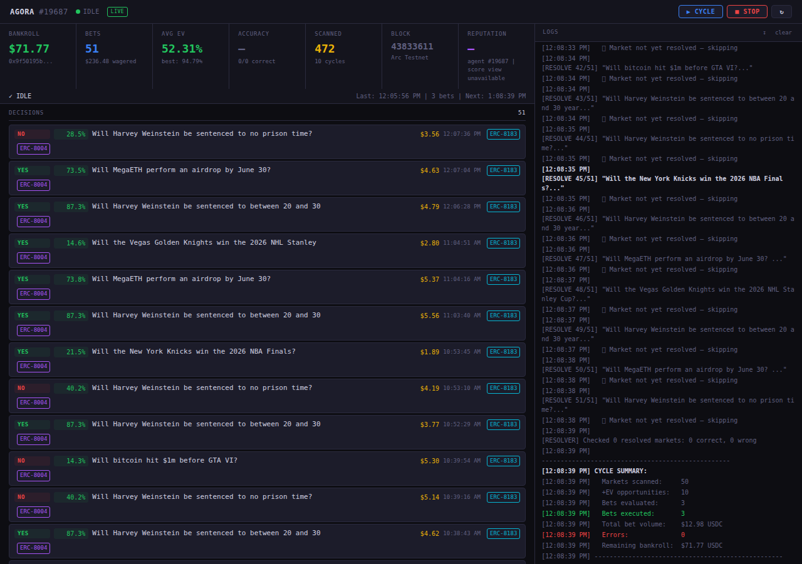

# Agora Prediction Market Agent

> **Agora Agents Hackathon** — Canteen × Circle × Arc  
> Autonomous AI agent for onchain prediction markets with ERC-8183 job settlement and ERC-8004 reputation tracking

An autonomous AI agent that continuously monitors **Polymarket** for mispriced prediction markets, estimates true probabilities via **Groq LLM**, computes expected value with **Kelly-optimal bet sizing**, and executes bets through **Circle SCA wallets** on **Arc testnet** — recording every action as a verifiable **ERC-8183** job lifecycle with **ERC-8004** onchain reputation.

[](http://18.140.114.181:3000)

<p align="center">
  
  <br>
  <em>Live dashboard — 7 metric cards, cycle progress bar, decision feed with onchain explorer links, SSE log stream</em>
</p>
[](https://testnet.arcscan.app/token/0x8004A818BFB912233c491871b3d84c89A494BD9e/instance/19687)
[](https://testnet.arcscan.app)
[](LICENSE)
[](https://github.com/0xdirosa/agora-prediction-agent)

---

## Architecture

```
                          Polymarket Gamma API
                                │ (fetch top 50 markets)
                                ▼
                     ┌─────────────────────┐
                     │   Market Scanner     │
                     │  vol > $1,000        │
                     │  price 8%–92%        │
                     └────────┬────────────┘
                              │ filtered markets
                              ▼
                     ┌─────────────────────┐
                     │  Groq Mixtral 8×7B   │
                     │  temperature 0.5     │
                     │  adjustment prompt   │
                     │  ±10pp clamp         │
                     └────────┬────────────┘
                              │ estimated probability
                              ▼
                     ┌─────────────────────┐
                     │   EV Calculator     │
                     │  both YES + NO       │
                     │  EV = p×odds-(1-p)  │
                     │  MIN_EDGE = 1%      │
                     │  threshold = 10% EV  │
                     └────────┬────────────┘
                              │ top opportunities
                              ▼
                     ┌─────────────────────┐
                     │   Decision Engine   │
                     │  half-Kelly sizing  │
                     │  category diversify │
                     │  cap 10% bankroll   │
                     └────────┬────────────┘
                              │ approved bet
                              ▼
        ┌──────────────────────────────────────────┐
        │           ONCHAIN LIFECYCLE              │
        │                                          │
        │  1. ERC-8183 Job (owner wallet)          │
        │     createJob → setBudget → approveUSDC  │
        │     → fund → submit → complete           │
        │                                          │
        │  2. ERC-8004 Feedback (validator)        │
        │     giveFeedback(agentId, 100, tag)      │
        │                                          │
        │  3. ERC-8004 Validation                  │
        │     owner → validationRequest()          │
        │     validator → validationResponse(100)  │
        │                                          │
        │  4. Market Resolution (next cycle)       │
        │     fetch resolved market outcome        │
        │     compare to prediction direction      │
        │     giveFeedback(correct=100/wrong=0)    │
        │     validationRequest + response         │
        └──────────────────────────────────────────┘
                              │
                              ▼
        ┌──────────────────────────────────────────┐
        │        Dashboard (Express + SSE)          │
        │  7 metric cards · cycle timer · log stream│
        │  100 decisions · explorer links · badges  │
        └──────────────────────────────────────────┘
```

## Key Features

| Feature | Detail |
|---------|--------|
| **AI Probability Estimation** | Groq Mixtral 8×7B (temperature 0.5), adjustment-based prompt, ±10pp clamping. Explicitly analyzes both "too LOW (YES value)" and "too HIGH (NO value)" |
| **EV Calculation** | Standard formula: `EV = ourProb × odds − (1 − ourProb)`. Evaluates BOTH YES and NO sides, takes maximum. MIN_EDGE = 1%, isValueBet threshold = 10% |
| **NO-side Conversion** | When betting NO: `betProb = 1 − finalProbability`, market price uses NO side |
| **Kelly Bet Sizing** | Half-Kelly criterion, capped at 10% of bankroll per bet. Full-Kelly: `f* = (bp − q) / b`, half-Kelly: `f* / 2` |
| **Price Filter** | Excludes markets outside 8%–92% price range to prevent longshot denominator overflow |
| **Volume Filter** | Excludes markets with volume < $1,000 to ensure liquidity |
| **ERC-8183 Job Lifecycle** | Full lifecycle per bet: `createJob → setBudget → approve → fund → submit → complete` |
| **ERC-8004 Reputation** | Validator wallet calls `giveFeedback()` with score=100 per prediction submitted. Separate accuracy-based scoring on market resolution (correct=100, wrong=0) |
| **ERC-8004 Validation** | Two-step: owner calls `validationRequest()`, validator calls `validationResponse(approved=100)` — 5-param ABI |
| **Anti Self-Dealing** | Two separate Circle SCA wallets: owner (agent operations) + validator (reputation/validation) in same wallet set |
| **Market Resolution** | Checks Polymarket Gamma API after market endDate, compares `outcomePrices[0]/[1]` to prediction direction, updates reputation with accuracy score |
| **Gasless Transactions** | All onchain transactions sponsored by Circle Gas Station — agent never manages gas |
| **Persistence** | Bets and cycle summaries saved to `data/bets.json` and `data/cycles.json` — survive server restarts |
| **Auto-start Loop** | Server boots → initializes agent → runs first cycle immediately → loops every `POLL_INTERVAL_MINUTES` (default 60) |
| **Bankroll Refresh** | Each cycle refreshes bankroll from wallet's onchain USDC balance |
| **Real-time Dashboard** | Express + SSE: 7 metric cards, cycle bar with countdown timer, decision feed with 100 entries, onchain explorer links per decision |
| **SSE Log Streaming** | Server-side capture of console output piped to browser via Server-Sent Events |

## Smart Contracts (Arc Testnet)

| Contract | Address | Explorer |
|----------|---------|----------|
| ERC-8004 **IdentityRegistry** | `0x8004A818BFB912233c491871b3d84c89A494BD9e` | [Arcscan](https://testnet.arcscan.app/address/0x8004A818BFB912233c491871b3d84c89A494BD9e) |
| ERC-8004 **ReputationRegistry** | `0x8004B663056A597Dffe9eCcC1965A193B7388713` | [Arcscan](https://testnet.arcscan.app/address/0x8004B663056A597Dffe9eCcC1965A193B7388713) |
| ERC-8004 **ValidationRegistry** | `0x8004Cb1BF31DAf7788923b405b754f57acEB4272` | [Arcscan](https://testnet.arcscan.app/address/0x8004Cb1BF31DAf7788923b405b754f57acEB4272) |
| ERC-8183 **AgenticCommerce** | `0x0747EEf0706327138c69792bF28Cd525089e4583` | [Arcscan](https://testnet.arcscan.app/address/0x0747EEf0706327138c69792bF28Cd525089e4583) |
| **USDC** (ERC-20, 6 decimals) | `0x3600000000000000000000000000000000000000` | — |

### ERC-8183 ABI Functions

| Function | Signature | Called By |
|----------|-----------|-----------|
| `createJob` | `(address,address,uint256,string,address)` | Owner wallet |
| `setBudget` | `(uint256,uint256,bytes)` | Owner wallet (acts as provider) |
| `approve` | `(address,uint256)` — on USDC contract | Owner wallet (client role) |
| `fund` | `(uint256,bytes)` | Owner wallet (client role) |
| `submit` | `(uint256,bytes32,bytes)` | Owner wallet (provider role) |
| `complete` | `(uint256,bytes32,bytes)` | Owner wallet (evaluator role) |

### ERC-8004 ABI Signatures

| Function | Full Signature | Called By |
|----------|---------------|-----------|
| `register` | `register(string)` — IdentityRegistry | Owner wallet |
| `giveFeedback` | `giveFeedback(uint256,int128,uint8,string,string,string,string,bytes32)` — ReputationRegistry | **Validator wallet** |
| `validationRequest` | `validationRequest(address,uint256,string,bytes32)` — ValidationRegistry | Owner wallet |
| `validationResponse` | `validationResponse(bytes32,uint8,string,bytes32,string)` — ValidationRegistry | **Validator wallet** (5 params) |
| `getValidationStatus` | `getValidationStatus(bytes32)` — ValidationRegistry view | Any (read-only) |

## Agent Identity

| Property | Value |
|----------|-------|
| **Agent ID** | #19687 |
| **Owner Wallet** | `0x9f50195b110d65737e82d089da0cd32590820ad5` |
| **Validator Wallet** | `0x2762e2271d6f3626c95af8be5c5785cf51583681` |
| **Wallet Set ID** | `REMOVED` |
| **Wallet Type** | SCA (Smart Contract Account), 2-of-2 in same wallet set |

## Results (Live Testnet)

| Metric | Value |
|--------|-------|
| Total autonomous cycles | 9+ |
| Markets scanned | 370+ |
| Bets placed | 51+ |
| Total wagered | ~$220 USDC |
| Avg EV per bet | ~51% |
| Best EV captured | ~95% |
| ERC-8183 jobs created | 44+ (IDs: 43180, 43183, 43192, 43499, 43644, 43645, 43647, 43712, 43714, 43726, 43730, ...) |
| ERC-8004 reputation feedbacks | 9+ (score=100 each, from validator wallet) |
| ERC-8004 validation requests | 6+ (all approved with response=100) |
| Market types covered | Sports (NBA, NHL, FIFA), Legal (Harvey Weinstein sentence), Crypto (MegaETH airdrop, Bitcoin price) |
| Directional bets | Both YES and NO directions |
| Gas | Fully sponsored by Circle Gas Station ($0 gas cost) |
| Dashboard | [http://18.140.114.181:3000](http://18.140.114.181:3000) |

## Probability Estimation Prompt

The agent uses Groq Mixtral 8×7B with temperature 0.5 and an **adjustment-based** prompt:

```
Analyze this prediction market and estimate the true probability.
Current market prices: {yesPrice}% YES, {noPrice}% NO.

Consider whether the market is overpriced or underpriced.
If you believe the market price is too LOW (YES is a value bet), estimate higher.
If you believe the market price is too HIGH (NO is a value bet), estimate lower.

Return ONLY a number between 0 and 1 representing your estimated probability of YES.
```

The raw output is clamped to within ±10 percentage points of the market price for stability.

## EV Calculation

```
For YES direction:
  odds = 1 / yesPrice
  EV = finalProbability × odds − (1 − finalProbability)

For NO direction:
  betProb = 1 − finalProbability      (convert to NO probability)
  odds = 1 / noPrice
  EV = betProb × odds − (1 − betProb)

MIN_EDGE = 0.01 (1%)
isValueBet = EV > 0.10 (10%)
```

## Setup

### Prerequisites

- **Node.js** 18+
- **Circle API Key** — from [Circle Developer Console](https://console.circle.com) (Keys → Create API Key)
- **Circle Entity Secret** — register via [Circle docs](https://developers.circle.com/wallets/dev-controlled/register-entity-secret)
- **Groq API Key** — from [Groq Console](https://console.groq.com)

### Installation

```bash
git clone https://github.com/0xdirosa/agora-prediction-agent.git
cd agora-prediction-agent
npm install
cp .env.example .env
```

### Environment Variables

| Variable | Required | Description |
|----------|----------|-------------|
| `CIRCLE_API_KEY` | ✅ | Circle Developer API key |
| `CIRCLE_ENTITY_SECRET` | ✅ | Registered entity secret |
| `GROQ_API_KEY` | ✅ | Groq inference API key |
| `ARC_AGENT_ID` | ✅ | Agent ID from ERC-8004 registration (`19687`) |
| `VALIDATOR_WALLET_ADDRESS` | ✅ | Validator wallet hex address |
| `CIRCLE_WALLET_ID` | ✅ | Owner wallet ID (from wallet setup) |
| `CIRCLE_WALLET_ADDRESS` | ✅ | Owner wallet address |
| `CIRCLE_WALLET_SET_ID` | ✅ | Wallet set ID (from wallet setup) |
| `POLL_INTERVAL_MINUTES` | ❌ | Auto-cycle interval (default: `60`) |
| `SIMULATED_BANKROLL` | ❌ | Fallback bankroll when USDC balance unavailable (default: `1000`) |
| `API_PORT` | ❌ | Dashboard port (default: `3000`) |

### Wallet Setup (first time only)

```bash
# 1. Generate entity secret
node scripts/generate-entity-secret.mjs

# 2. Create wallet set + owner wallet
node scripts/setup-wallet.mjs

# 3. Fund owner wallet via Circle Faucet
#    https://faucet.circle.com or https://console.circle.com/faucet

# 4. Register agent identity on ERC-8004 IdentityRegistry
#    Mints identity NFT, assigns Agent ID
node scripts/register-agent.mjs

# 5. Create validator wallet (separate SCA for ERC-8004 compliance)
node scripts/create-validator-wallet.mjs
```

### Run

```bash
# Single analysis cycle (dry run by default)
npm start -- --once

# Live autonomous loop (requires funded wallet + agent registration)
npm start

# Web dashboard (auto-starts agent loop on boot)
npm run server
# Open http://localhost:3000
```

## Dashboard

The web dashboard is served from the Express server and provides:

- **7 Metric Cards**: Bankroll, Bets placed, Avg EV, Accuracy, Markets scanned, Current block, Reputation score
- **Cycle Bar**: Auto-loop status with next cycle countdown timer
- **Status Dot**: Green = idle/running, Gray = stopped. Live/Dry-run mode badge
- **Decision Feed**: Up to 100 decisions with direction badge (YES/NO), EV%, bet size, timestamp, ERC-8183 explorer link, ERC-8004 explorer link, resolution badge (✓/✗)
- **Log Stream**: Real-time SSE log output with auto-scroll
- **Refresh**: Auto-polls every 5 seconds

### Dashboard URL

**Public:** [http://18.140.114.181:3000](http://18.140.114.181:3000)

## API Endpoints

| Method | Route | Description |
|--------|-------|-------------|
| `GET` | `/api/status` | Agent status (`running`/`idle`/`stopped`), mode (`live`/`dry_run`), cycle info, next cycle time |
| `GET` | `/api/wallet` | Owner wallet address, USDC balance, bankroll, block number, network |
| `GET` | `/api/metrics` | Total cycles, bets placed, total wagered, avg/best EV, accuracy rate, bankroll remaining |
| `GET` | `/api/decisions` | Bet decisions (up to 100) with EV, job IDs, tx hashes, resolution status |
| `GET` | `/api/reputation` | Agent ID, score (null if view unavailable), feedback count, validator address |
| `GET` | `/api/resolution` | Accuracy stats: total bets, resolved count, correct count, accuracy percentage |
| `GET` | `/api/logs` | Last 200 log entries with timestamps and levels |
| `GET` | `/api/logs/stream` | **SSE** — real-time log stream (Server-Sent Events) |
| `POST` | `/api/start` | Trigger one analysis cycle manually |
| `POST` | `/api/stop` | Stop the auto-cycle loop |
| `POST` | `/api/resolve` | Trigger market resolution check for expired markets |

## Project Structure

```
src/
  agent/
    predictionAgent.ts    Core agent: scan → evaluate → execute → resolve
    types.ts              BetRecord, MarketOpportunity, CycleSummary, BetDecision
  analysis/
    sentimentAnalyzer.ts  Groq LLM probability estimation (temperature 0.5)
    evCalculator.ts       EV formula, Kelly Criterion, isValueBet
  markets/
    polymarketClient.ts   Polymarket Gamma API + CLOB API client
  wallet/
    circleWallet.ts       Circle Developer-Controlled Wallets SDK wrapper
                          (init, create wallets, transfer, balance, gasless)
  jobs/
    erc8183Client.ts      ERC-8183 job lifecycle
                          (createJob, setBudget, approveUSDC, fund, submit, complete)
    agentIdentity.ts      ERC-8004 identity registration + lookup
                          (registerIdentity, hasIdentity, getAgentIdByOwner)
    reputationClient.ts   ERC-8004 giveFeedback (validator → ReputationRegistry)
    validationClient.ts   ERC-8004 validation request/response
                          (requestValidation, respondToValidation, getValidationStatus)
    marketResolver.ts     Polymarket outcome resolution + accuracy-based reputation
    persistence.ts        Save/load BetRecord[] and CycleSummary[] to/from JSON
  arc/
    constants.ts          Contract addresses, RPC URL, viem clients, chain config
    arcClient.ts          Low-level Arc RPC helpers
    agentRegistry.ts      Full ERC-8004 registration flow (identity + metadata)
  server.ts               Express server: API routes, dashboard static, SSE, auto-loop
  log-stream.ts           Console stream capture + SSE broadcasting
dashboard/
  index.html              Dark-theme single-page dashboard (499 lines, no framework)
data/                     Runtime state (gitignored)
  bets.json               Persisted bet records
  cycles.json             Persisted cycle summaries
scripts/
  generate-entity-secret.mjs
  setup-wallet.mjs
  create-validator-wallet.mjs
  register-agent.mjs
  verify-setup.mjs
```

## Tech Stack

| Layer | Technology |
|-------|-----------|
| **Runtime** | Node.js 22+ with TypeScript (tsx) |
| **AI Inference** | Groq SDK — `mixtral-8x7b-32768` (temperature 0.5) |
| **Blockchain SDK** | viem — `arcTestnet` chain (chainId: 5042002) |
| **Wallet Provider** | `@circle-fin/developer-controlled-wallets` v10.3.1 — SCA wallets via Circle Gas Station |
| **API Framework** | Express.js — REST API + static file server |
| **Real-time** | Server-Sent Events (SSE) — log streaming to dashboard |
| **Market Data** | Polymarket Gamma API (markets) + CLOB API (prices, books) |
| **Onchain Standards** | ERC-8004 (Identity, Reputation, Validation) + ERC-8183 (Job Settlement) |
| **Persistence** | Local JSON files (`data/bets.json`, `data/cycles.json`) |
| **Gas Model** | Zero-gas via Circle Gas Station (sponsored transactions) |

## Data Flow

```
┌─────────┐    ┌──────────┐    ┌────────┐    ┌──────────────┐
│Cron/SSE │───▶│ Server   │───▶│ Agent  │───▶│ Market       │
│Loop     │    │(Express) │    │(Engine)│    │Scanner       │
└─────────┘    └──────────┘    └────────┘    └──────┬───────┘
      ▲                                               │
      │                                               ▼
      │                                        ┌──────────────┐
      │                                        │ Groq LLM     │
      │                                        │ Probability   │
      │                                        │ Estimation   │
      │                                        └──────┬───────┘
      │                                               │
      │                                               ▼
      │                                        ┌──────────────┐
      │                                        │ EV Calculator │
      │                                        │ + Kelly       │
      │                                        └──────┬───────┘
      │                                               │
      │                                               ▼
      │                                        ┌──────────────┐
      │                                        │Decision Engine│
      │                                        │ + Execute Bet │
      │                                        └──────┬───────┘
      │                                               │
      │                                               ▼
      │                              ┌────────────────────────────┐
      │                              │  Onchain (Arc Testnet)     │
      │                              │  ┌──────────────────────┐  │
      │                              │  │ ERC-8183: ↑↑↑       │  │
      │◀──── Persist ◀──── bet ◀─────│  │ create → ... → done │  │
      │                              │  ├──────────────────────┤  │
      │                              │  │ ERC-8004: feedback   │  │
      │                              │  │ + validation         │  │
      │                              │  └──────────────────────┘  │
      └────────── display ◀──────────└────────────────────────────┘
```

## Known Limitations

- **ReputationRegistry view functions**: The deployed ReputationRegistry contract has no `getAgentScore()` or `getFeedbackCount()` view functions. Reputation scores are write-only onchain. Dashboard shows "score view unavailable."
- **Single-wallet roles**: Both ERC-8183 client and provider roles use the same wallet. The contract does not enforce `client != provider`, so this is functionally identical but deviates from the tutorial's two-wallet pattern.
- **Validator independence**: Both wallets share the same Circle wallet set. True independence would require a wallet from a different wallet set or a third-party validator.

## Hackathon Context

Created for the **Agora Agents Hackathon** (May 2026) — a collaboration between [Canteen](https://canteen.io), [Circle](https://circle.com), and [Arc](https://arc.network).

---

<p align="center">
  <sub>Built with Groq, Circle, Arc, and Polymarket</sub>
</p>
